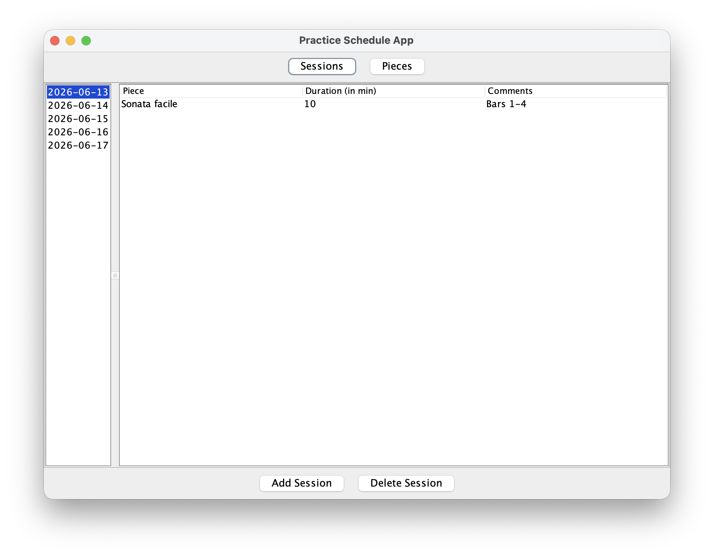

# Practice Schedule App

A desktop application for musicians to organize practice sessions and 
keep track of pieces they are currently working on. Built with Java 
Swing as a personal learning project.

## Screenshots



## Features

- Add/delete musical pieces
- Add/delete practice sessions
- Store data locally in .txt files

## Installation

### 1. Clone the repository 

```bash
git clone https://github.com/a-glig/practice-schedule-app.git
```

### 2. Open the project in IntelliJ IDEA and run

```bash
Main.java
```

## Technologies used

- Java 
- Swing

## What I Learned 

- GUI development
- Object-oriented design
- file persistence

## Future Improvements

- Changing entries 
- Search and Filtering
- Statistics Dashboard
- Export functionality

## Licence

This project is licensed under the MIT License. 